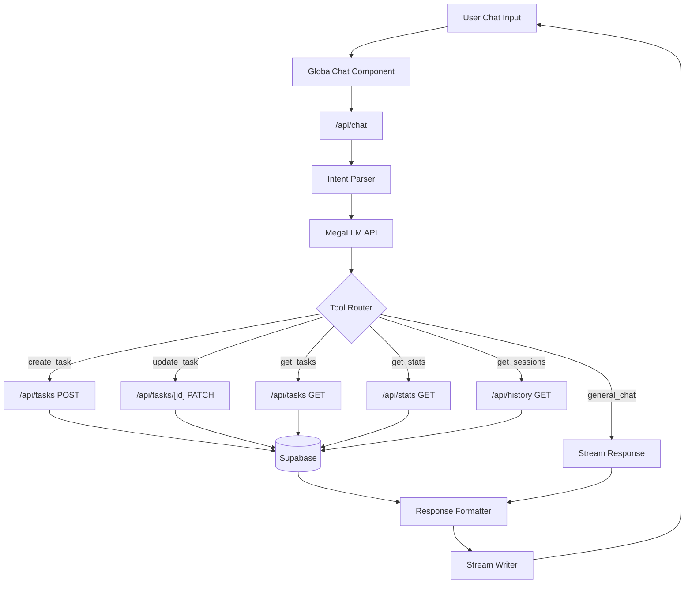

# System Design & Architecture

## Architecture Overview

**What is the high-level system structure?**



### Key Components

1. **Intent Parser**: Analyzes user messages to determine if they want to perform task/session operations or just chat
2. **Tool Router**: Routes parsed intents to appropriate API endpoints
3. **Response Formatter**: Converts API responses to natural language for the chatbot

### Technology Stack

- **LLM**: MegaLLM API (existing)
- **Tool Calling**: OpenAI-compatible function calling (if supported) or structured prompt engineering
- **Backend**: Next.js API Routes (existing)
- **Database**: Supabase (existing)

## Data Models

**What data do we need to manage?**

### Existing Entities (No Changes Required)

- **tasks**: Already has all fields needed (title, description, priority, status, tags, etc.)
- **sessions**: Already tracks Pomodoro sessions with duration, mode, task_id
- **streaks**: Already tracks current and longest streaks

### Chat Context (New Concept)

For multi-turn conversations involving tasks, we may need to track context:

```typescript
interface ChatToolContext {
  lastMentionedTaskId?: string;
  lastQueryType?: 'tasks' | 'sessions' | 'stats';
  pendingConfirmation?: {
    action: 'create' | 'update' | 'delete';
    payload: any;
  };
}
```

## API Design

**How do components communicate?**

### Enhanced Chat API Flow

The existing `/api/chat` route will be enhanced to:

1. Parse user intent from messages
2. Call appropriate internal APIs when task/session operations are detected
3. Format results as natural language responses

### Tool Definitions (for LLM Function Calling)

```typescript
const chatTools = [
  {
    name: "create_task",
    description: "Create a new task for the user",
    parameters: {
      title: { type: "string", required: true },
      description: { type: "string" },
      priority: { type: "string", enum: ["LOW", "MEDIUM", "HIGH"] },
      estimate_pomodoros: { type: "number" },
      tags: { type: "array", items: { type: "string" } },
      due_date: { type: "string", format: "date" }
    }
  },
  {
    name: "update_task",
    description: "Update an existing task",
    parameters: {
      task_identifier: { type: "string", description: "Task title or ID" },
      updates: {
        title: { type: "string" },
        description: { type: "string" },
        priority: { type: "string", enum: ["LOW", "MEDIUM", "HIGH"] },
        status: { type: "string", enum: ["TODO", "DOING", "DONE"] },
        tags: { type: "array" }
      }
    }
  },
  {
    name: "search_tasks",
    description: "Search for tasks based on criteria",
    parameters: {
      query: { type: "string" },
      status: { type: "string", enum: ["TODO", "DOING", "DONE", "all"] },
      priority: { type: "string", enum: ["LOW", "MEDIUM", "HIGH", "all"] }
    }
  },
  {
    name: "get_stats",
    description: "Get user's productivity statistics",
    parameters: {
      period: { type: "string", enum: ["today", "week", "month", "custom"] },
      start_date: { type: "string" },
      end_date: { type: "string" }
    }
  },
  {
    name: "get_sessions",
    description: "Get user's Pomodoro session history",
    parameters: {
      limit: { type: "number" },
      start_date: { type: "string" },
      end_date: { type: "string" }
    }
  }
];
```

## Component Breakdown

**What are the major building blocks?**

### Backend Changes

#### 1. `src/lib/chat-tools/` (NEW)

- `tool-definitions.ts`: Define available tools and their schemas
- `tool-executor.ts`: Execute tool calls against internal APIs
- `response-formatter.ts`: Format tool results as natural language

#### 2. `src/app/api/chat/route.ts` (MODIFY)

- Add tool/function calling support to the LLM request
- Handle tool call responses from LLM
- Execute tools and feed results back to LLM for final response

#### 3. `src/lib/prompts/bro-ai-system.ts` (MODIFY)

- Update system prompt to include tool usage instructions
- Add guidelines for confirming actions before execution

### Frontend Changes

#### 1. `src/components/chat/global-chat.tsx` (MINOR MODIFY)

- May need to handle special response types (e.g., task created confirmation)
- Consider adding action buttons for common operations

## Design Decisions

**Why did we choose this approach?**

### Decision 1: Server-side Tool Execution

**Choice**: Execute tools on the server in `/api/chat` route rather than client-side
**Rationale**:

- Security: User authentication already handled server-side
- Simplicity: No need for additional client-server roundtrips
- Consistency: Single streaming response for entire interaction

### Decision 2: LLM Function Calling vs Prompt Engineering

**Choice**: Prefer function calling if MegaLLM supports it; fallback to structured prompts
**Rationale**:

- Function calling provides structured, predictable output
- Fallback ensures feature works regardless of LLM capabilities

### Decision 3: Implicit Task Resolution

**Choice**: Use fuzzy matching to resolve task names to IDs
**Rationale**:

- Better UX - users don't need to remember exact task titles
- Handle cases like "mark the math task as done" → find task containing "math"

## Non-Functional Requirements

**How should the system perform?**

### Performance Targets

- Task creation: < 2 seconds total response time
- Task queries: < 1.5 seconds for simple queries
- Stats queries: < 2 seconds

### Security Requirements

- All operations require authenticated user
- Users can only access their own tasks/sessions
- Rate limiting on task operations (prevent abuse)

### Reliability

- Graceful degradation if tool execution fails
- Clear error messages for invalid operations
- Transaction-like handling (don't partially complete multi-step operations)
