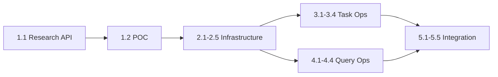

# Project Planning & Task Breakdown

## Milestones

**What are the major checkpoints?**

- [ ] Milestone 1: Research & Validation - Verify MegaLLM function calling support
- [ ] Milestone 2: Core Infrastructure - Tool execution framework
- [ ] Milestone 3: Task Operations - Create, update, search tasks via chat
- [ ] Milestone 4: Query Operations - Stats and session queries via chat
- [ ] Milestone 5: Polish & Testing - Error handling, edge cases, Vietnamese support

## Task Breakdown

**What specific work needs to be done?**

### Phase 1: Research & Foundation

- [ ] Task 1.1: Research MegaLLM API capabilities for function/tool calling
- [ ] Task 1.2: Create proof-of-concept for tool calling with simple example
- [ ] Task 1.3: Design fallback approach if function calling not supported

### Phase 2: Core Infrastructure

- [ ] Task 2.1: Create `src/lib/chat-tools/` directory structure
- [ ] Task 2.2: Implement `tool-definitions.ts` with all tool schemas
- [ ] Task 2.3: Implement `tool-executor.ts` for calling internal APIs
- [ ] Task 2.4: Implement `response-formatter.ts` for natural language responses
- [ ] Task 2.5: Update system prompt in `bro-ai-system.ts`

### Phase 3: Task Operations

- [ ] Task 3.1: Implement create_task tool execution
- [ ] Task 3.2: Implement update_task tool with fuzzy task matching
- [ ] Task 3.3: Implement search_tasks tool execution
- [ ] Task 3.4: Test task operations end-to-end

### Phase 4: Query Operations

- [ ] Task 4.1: Implement get_stats tool execution
- [ ] Task 4.2: Implement get_sessions tool execution
- [ ] Task 4.3: Format stats responses with natural language (streaks, totals, etc.)
- [ ] Task 4.4: Test query operations end-to-end

### Phase 5: Integration & Polish

- [ ] Task 5.1: Update `/api/chat/route.ts` to handle tool calls in stream
- [ ] Task 5.2: Handle multi-turn conversations with context
- [ ] Task 5.3: Implement error handling and user-friendly error messages
- [ ] Task 5.4: Test Vietnamese language support for commands
- [ ] Task 5.5: Performance testing and optimization

## Dependencies

**What needs to happen in what order?**

### Task Dependencies

- All Phase 2+ tasks depend on verifying MegaLLM capabilities (Task 1.1)
- Task 3.x and 4.x can be developed in parallel after Phase 2
- Phase 5 requires both Phase 3 and 4 to be complete

### External Dependencies

- MegaLLM API documentation/support
- Existing tasks/stats/history API endpoints (already available)

## Timeline & Estimates

**When will things be done?**

| Phase | Estimated Effort | Description |
|-------|-----------------|-------------|
| Phase 1 | 2-3 hours | Research and POC |
| Phase 2 | 4-6 hours | Core infrastructure |
| Phase 3 | 4-5 hours | Task operations |
| Phase 4 | 3-4 hours | Query operations |
| Phase 5 | 4-5 hours | Integration and polish |
| **Total** | **17-23 hours** | |

## Risks & Mitigation

**What could go wrong?**

### Technical Risks

| Risk | Impact | Likelihood | Mitigation |
|------|--------|------------|------------|
| MegaLLM doesn't support function calling | High | Medium | Fallback to structured prompt engineering |
| Fuzzy task matching produces wrong results | Medium | Medium | Add confirmation step for destructive operations |
| LLM context length exceeded with many tasks | Low | Low | Limit task results, summarize when needed |
| Response streaming doesn't work with tool calls | Medium | Low | Buffer tool results, stream final response |

### Mitigation Strategies

1. **POC First**: Validate LLM capabilities before building infrastructure
2. **Confirmation UX**: For updates/deletes, ask user to confirm before executing
3. **Graceful Degradation**: If tools fail, fall back to helpful error message

## Resources Needed

**What do we need to succeed?**

### Tools and Services

- MegaLLM API (existing)
- Supabase database (existing)
- Next.js development environment (existing)

### Documentation/Knowledge

- MegaLLM API documentation for function calling
- OpenAI function calling specification (reference)
- Existing codebase understanding of tasks/chat APIs
