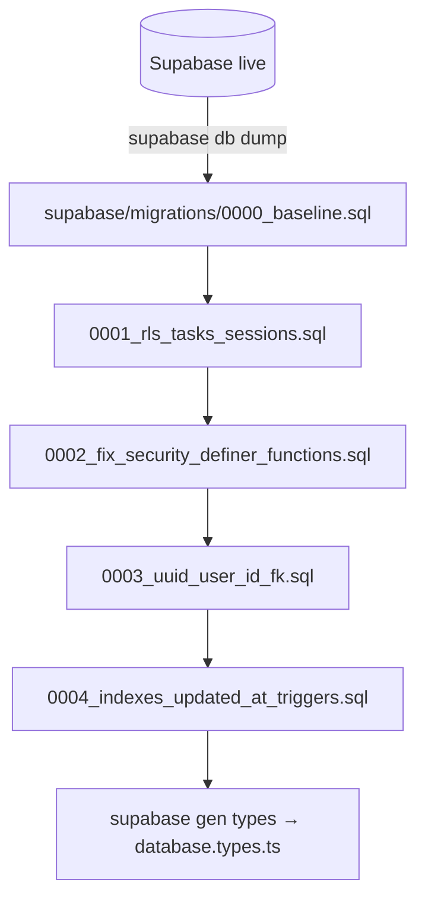

# Phase 02: DB baseline & RLS

## Context links
- Report §2: [review-261001-0847-project-gap-analysis.md](../reports/review-261001-0847-project-gap-analysis.md)
- Plan: [plan.md](plan.md)

## Overview
- Date: 2026-10-01 | Priority: P0 | Status: pending | Effort: ~1.5d
- Blocker: cần quyền DB live. Supabase MCP chưa auth trong session này, chạy `/mcp` hoặc dùng `supabase login`.

## Key insights
- Repo không có `CREATE TABLE` cho `tasks`/`sessions` và không có RLS cho `tasks`. DB live là nguồn sự thật duy nhất.
- `user_id` là TEXT, nên không có FK/cascade và cast làm mất index.
- `increment_task_pomodoro` và `get_leaderboard` là SECURITY DEFINER, không set `search_path`, có grant cho anon.

## Requirements
1. Kiểm ngay RLS live trên `tasks`, `sessions`, `streaks`, `messages`, `conversations`, `feedbacks`, `user_tags`.
2. Adopt Supabase CLI: `supabase/` + `config.toml` + baseline migration dump từ live.
3. Sửa function: dùng `auth.uid()`, `SET search_path = ''`, revoke anon/public.
4. Khoá leaderboard: view `security_invoker = true` hoặc RPC chỉ cho authenticated, chỉ trả cột cần thiết.
5. Đổi `user_id` sang uuid + FK `auth.users ON DELETE CASCADE` cho `tasks` và `sessions`.
6. Thêm index composite. Thêm trigger `updated_at`.
7. Sinh `src/types/database.types.ts`, gõ type cho Supabase client.

## Architecture

- Giữ `migrations/` cũ ở dạng archive (`migrations/_legacy/`) để tham chiếu lịch sử. Không chạy lại các file đó.

## Related code files
- `migrations/*.sql` (002, 007, 011, 012, 013, 014; 009/010 rỗng)
- `supabase_schema.sql`, `fix_sessions_rls.sql` (root)
- `src/lib/supabase-*.ts`, `src/app/api/**` (`.from()`, `.rpc()`)

## Implementation steps
1. Chạy `select relname, relrowsecurity from pg_class where relnamespace='public'::regnamespace` và `select * from pg_policies`. Ghi kết quả vào report.
2. Nếu `tasks`/`sessions` chưa bật RLS: **hotfix ngay**, bật RLS và thêm 4 policy `auth.uid()::text = user_id`.
3. `supabase init` → `supabase db dump --schema public > supabase/migrations/<ts>_baseline.sql`.
4. Migration sửa function:
   - `increment_task_pomodoro(task_id, duration)` lấy user từ `auth.uid()` thay vì nhận tham số.
   - Thêm `SET search_path = ''` cho mọi SECURITY DEFINER.
   - `REVOKE EXECUTE ... FROM public, anon`.
5. Leaderboard:
   - Chọn 1 nguồn (view hoặc RPC) và drop nguồn còn lại.
   - Revoke anon nếu leaderboard không public.
   - `profiles` SELECT chỉ cho authenticated, hoặc thêm cờ `is_public`.
6. uuid migration:
   - Thêm cột mới `user_uuid uuid`, backfill `user_id::uuid`, kiểm không còn giá trị null hoặc lỗi.
   - Swap cột và thêm FK cascade.
   - Cập nhật policy bỏ cast.
7. Index:
   - `sessions(user_id, created_at desc)`, `sessions(task_id)`, `tasks(user_id, is_deleted, display_order)`.
   - Bọc `auth.uid()` thành `(select auth.uid())` trong policy.
8. Trigger `updated_at` cho `tasks`, `profiles`, `streaks`.
9. Feedback policy: `WITH CHECK (user_id IS NULL OR user_id = auth.uid())`.
10. Bỏ `DROP TABLE` trong `supabase_schema.sql`. Chuyển 2 file SQL ở root vào legacy.
11. `supabase gen types typescript` → `createClient<Database>()`.
12. RPC `get_user_stats(from, to, tz)` có `GROUP BY` thay cho aggregate bằng JS. `record_session()` chạy trong 1 transaction và nhận timezone.

## Todo list
- [ ] Audit RLS live + hotfix nếu thiếu
- [ ] Supabase CLI + baseline dump
- [ ] Fix SECURITY DEFINER functions
- [ ] Leaderboard/profile exposure
- [ ] TEXT → uuid + FK cascade
- [ ] Index + updated_at triggers
- [ ] Generated types
- [ ] RPC stats/record_session (atomic, timezone-aware)

## Success criteria
- `supabase db reset` dựng DB local chạy được app.
- Test RLS (pgTAP hoặc script với 2 user): user A không đọc hay ghi được data của user B. anon không gọi được RPC ghi.
- `EXPLAIN` query history/stats dùng index.

## Risk assessment
- Migration uuid trên production có thể lock bảng. Chạy giờ thấp điểm, backup trước (PITR hoặc `pg_dump`).
- Bật RLS sai làm user mất data hiển thị. Test trên branch DB (Supabase branching) trước.

## Security considerations
- Không commit connection string hay service role key. Dump schema không kèm data.
- Review mọi function SECURITY DEFINER còn lại sau baseline dump.

## Next steps
Phase 03 dùng `record_session()`. Phase 05 viết README setup DB dựa trên CLI.
