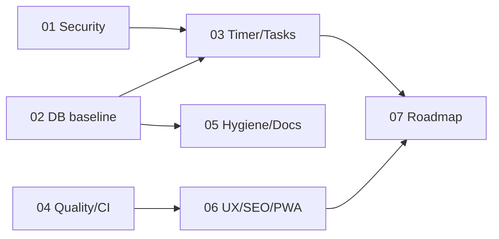

# Project Gap Remediation

## Bối cảnh
Review toàn diện ngày 2026-10-01: [review-261001-0847-project-gap-analysis.md](../reports/review-261001-0847-project-gap-analysis.md).
UI giàu tính năng, nhưng nền móng yếu: DB không tái tạo được, có lỗ bảo mật thật, dữ liệu phiên học bị ghi sai, không có test/CI.

## Nguyên tắc
- Làm nền móng trước, tính năng sau. Mỗi phase là 1 PR, revert được.
- YAGNI: không thêm thư viện nếu không bắt buộc. Rate limit dùng bảng Supabase hoặc Vercel Firewall trước khi nghĩ tới Upstash.
- Phase 02 cần quyền truy cập DB live (Supabase MCP hoặc CLI hiện **chưa auth** trong session này).
- **Phối hợp (2026-10-01 09:07):** một session khác đang làm UI redesign trên `feat/design-system`, ngay trong working tree chính. Session đó sửa tokens, Tailwind config, đổi icon lucide → Phosphor, và đụng nhiều file trong `src/`.
  - Implement plan này trong **git worktree riêng tách từ `master`**.
  - Không checkout, stash hay reset working tree chính.
  - Phase 05 và 06 đụng `package.json`, `src/components/**`, landing. Rebase sau khi `feat/design-system` merge.

## Phases

| # | Phase | Ưu tiên | Effort | Status | Phụ thuộc |
|---|---|---|---|---|---|
| 01 | [Security hotfixes](phase-01-security-hotfixes.md) | P0 | 1d | **done** (2 phần chuyển sang 02) | — |
| 02 | [DB baseline & RLS](phase-02-db-baseline-and-rls.md) | P0 | 1.5d | **blocked** — cần quyền DB live | quyền DB live |
| 03 | [Timer & tasks data correctness](phase-03-timer-tasks-data-correctness.md) | P1 | 1.5d | **done** (idempotency server chờ 02) | 01 |
| 04 | [Quality gates & CI](phase-04-quality-gates-and-ci.md) | P1 | 1.5d | **done** | — |
| 05 | [Repo hygiene & docs](phase-05-repo-hygiene-and-docs.md) | P2 | 0.5d | **partial** — README, .env.example xong; dọn deps/file rác chờ merge design-system | 02, merge design-system |
| 06 | [UX, SEO, i18n, PWA, account](phase-06-ux-seo-i18n-pwa-account.md) | P2 | 2d | **done** (lớp UX/chức năng; visual thuộc feat/design-system) | 04 |
| 07 | [Product roadmap gaps](phase-07-product-roadmap-gaps.md) | P3 | TBD | **partial** — đã quyết tính năng ẩn; roadmap mới chờ | quyết định sản phẩm |

Kết quả triển khai: [implementation-261001-1000-gap-remediation.md](../reports/implementation-261001-1000-gap-remediation.md)

## Thứ tự chạy

Có thể chạy song song: 01 với 04. 02 bắt đầu ngay khi có quyền DB.

## Success criteria (toàn plan)
- `pnpm type-check`, `pnpm lint`, `pnpm test` cùng exit 0 trên CI. `ignoreBuildErrors` đã bỏ.
- DB dựng lại được từ repo (`supabase db reset`). Mọi bảng user-data có RLS. RLS có test.
- Không còn finding High trong report.
- Phiên học được ghi đúng duration, đúng 1 lần, kể cả khi reload, đóng tab hay mở nhiều tab.

## Quyết định đã chốt (2026-10-01)
- UI/UX chia lớp: `feat/design-system` làm visual; nhánh này làm UX/chức năng.
- History bật lại; `/progress` (placeholder) và `/focus` (chỉ có streak) bỏ, redirect về `/history`, streak chuyển sang History.
- Chat và Leaderboard ở sau feature flag, mặc định tắt (trang và API trả 404).
- Focus mode giả bị xoá. PWA giữ ở dạng installable, không có service worker.

## Câu hỏi mở
1. RLS live trên `tasks`/`sessions`? (chặn 02)
2. `NEXT_PUBLIC_MEGALLM_API_KEY` có trên Vercel không? Nếu có thì rotate.
3. Leaderboard public cho anon có chủ đích không? (trước khi bật flag)
4. Có track các thư mục AI tool (`.agent`, `.jules`, `.Jules`…) không? Lưu ý `.Jules/` và `.jules/` trùng tên khi macOS không phân biệt hoa thường.
