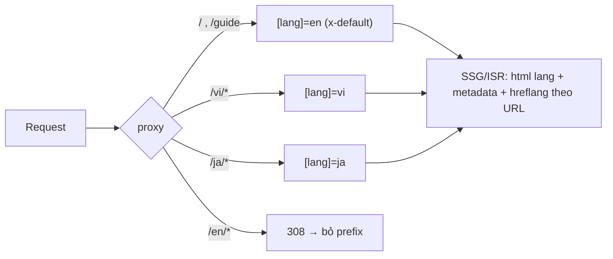

# SEO audit + keyword/SERP research — Study Bro

- Ngày: 2026-10-05 · Phạm vi: code `feat/design-system` (v2, chưa deploy) + production thật (`master`) + SERP EN/VI/JA
- Cách đo: curl/dig/RDAP, Chrome DevTools (Lighthouse + trace), fetch SSR HTML của dev server :3001 (Accept-Language khác nhau, không cookie), WebSearch (công cụ search **US-only, không phải Google VN/JP** → thứ hạng VI/JA chỉ mang tính chỉ báo). Không có dữ liệu volume (không có GKP/DataForSEO/GSC) → volume ghi theo bậc ước lượng.
- Repo chỉ đọc, không sửa code.

---

## 0. TL;DR

1. **`pomodorostudy.online` CHƯA được đăng ký.** DNS NXDOMAIN (1.1.1.1, 8.8.8.8), RDAP registry `rdap.radix.host` → `404 "Domain pomodorostudy.online is available for registration"`. Ai cũng mua được. v2 mặc định canonical/sitemap/OG/robots về domain này.
2. **Domain cũ `pomodoro-focus.site` hết hạn 2026-11-11** (còn ~37 ngày, registrar Hostinger). Mất domain cũ = mất toàn bộ index + backlink, không còn chỗ đặt 301.
3. Production đang chạy bản `master` cũ, cache CDN ~130 ngày (`age: 11239352`, `x-vercel-cache: HIT`). Đang lỗi SEO nặng: mọi trang con canonical về homepage, apex + www cùng trả 200. v2 sửa được phần lớn lỗi này.
4. v2: SSR tốt (FAQ/Features/HowItWorks/guide render server), canonical từng trang đúng. Nhưng **VI/JA không index được**: locale lấy từ cookie/Accept-Language trên cùng 1 URL, không có hreflang, Googlebot chỉ thấy EN. Thị trường thắng được dễ nhất lại chính là VI/JA.
5. Home v2 **không có H1** (timer `ssr:false`), metadata home tĩnh EN, ảnh OG `card.jpg` là UI cũ còn lộ **tên + email thật của bạn** và tính năng đã bỏ (Bro Chat, Bảng xếp hạng).
6. Cơ hội keyword tốt nhất: landing tool bằng VI/JA (`/vi`, `/ja`), trang preset VI/JA (50/10, 52/17, 25 phút, 90 phút), bài phương pháp VI có timer nhúng, ngách "pomodoro timer with games", và lên các bài listicle VN (thegioididong, quantrimang, ybox, fptshop).

---

## 1. Hiện trạng live (đo 2026-10-05)

| Kiểm tra | Kết quả | Bằng chứng |
|---|---|---|
| `pomodorostudy.online` (apex/www/http) | `curl: (6) Could not resolve host` | `dig @1.1.1.1` rỗng; RDAP radix 404 "available for registration" |
| `https://pomodoro-focus.site/` | **200** (không redirect về www) | `age: 11239352`, `x-matched-path: /`, `hkg1` |
| `https://www.pomodoro-focus.site/` | 200 | canonical tự trỏ `https://www.pomodoro-focus.site` |
| `http://pomodoro-focus.site/` | 308 → `https://pomodoro-focus.site/` (HTTPS OK, host không chuẩn hoá) | |
| NS domain cũ | apex: `dns-parking.com` (Hostinger) A `76.76.21.21`; www: CNAME vercel-dns | |
| Hạn domain cũ | `Registry Expiry Date: 2026-11-11` | whois |
| Bản đang chạy | master (Next 14): title "…with AI Coach & Task Management", H1 "Master YourFocus" (dính chữ), quảng cáo AI coach/leaderboard/Spotify, mockup ghi `studybro.app` (domain của sản phẩm khác: "StudyBro – AI Flashcards") | `live-www.html` |
| Canonical trang con | `/guide`, `/privacy`, `/terms`, `/leaderboard`, `/feedback`, `/timer`… **đều canonical = `https://www.pomodoro-focus.site`**, og:url = home, title "Study Bro App" | curl từng trang |
| hreflang | 4 thẻ en/vi/ja/x-default **cùng 1 URL** (vô nghĩa với Google) | home |
| og:image home | **thiếu** (trang con có, home không có) | grep |
| robots.txt | `Disallow: /timer/ /tasks/ …` (có dấu `/` cuối nên thực tế không chặn `/timer`) | |
| sitemap.xml | 6 URL, lastmod cứng `2026-02-08`, có `/leaderboard` (35 từ), `/feedback` | |
| `/privacy` SSR | 14 từ (render client) | |
| 404 | trả 404 + `noindex` (đúng) | |
| Google index | Brand query "Study Bro pomodoro timer" ra `https://pomodoro-focus.site/` (bản **apex**, ngược canonical www). `site:` qua WebSearch không ra trang nào → index rất mỏng, cần GSC xác nhận | WebSearch |
| CrUX | không có dữ liệu field → traffic rất thấp | trace |
| Lighthouse mobile (home prod) | SEO 100, Best Practices 100, A11y 87 (button-name, link-name, contrast), llms.txt fail | `lh/report.json` |
| Perf lab (Slow 4G, CPU 4x) | LCP 859 ms, TTFB 47 ms (CDN HIT), CLS 0 | trace |

Kết luận: prod hiện là landing tĩnh được cache CDN nên nhanh, nhưng chỉ index được homepage, nội dung lỗi thời. Đổi domain chưa xảy ra (domain mới chưa tồn tại).

## 2. v2 (`feat/design-system`): SSR thực tế (fetch không cookie)

| Trang | Kết quả |
|---|---|
| `/` Accept-Language en | 200, `lang=en`, title "Study Bro - Free Pomodoro Timer with Tasks & Focus Sounds", canonical `https://pomodorostudy.online`, **H1: không có**, H2: What's inside / How a Pomodoro cycle works / FAQ, ~720 từ, JSON-LD WebApplication + FAQPage(8), không hreflang |
| `/` Accept-Language vi | 200, `lang=vi`, body tiếng Việt, **title/description/OG vẫn EN**, cùng canonical, không hreflang |
| `/guide` en / ja | 200, H1 đúng, 8 H2, HowTo JSON-LD, canonical `/guide` cho cả 2 ngôn ngữ (bản JA không bao giờ được index) |
| `/privacy` | 200, ~630 từ SSR, canonical đúng |
| 404 | 404 + noindex, title "Study Bro App" (không có template) |
| `/timer` `/tasks` `/login` `/feedback` | redirect (opaqueredirect) → `/?panel=…` ✔ |
| **`/leaderboard`, `/chat`** | **404** (đang nằm trong sitemap/index của prod) |
| `/?panel=tasks` | canonical `/` ✔ |
| Header | `cache-control: no-cache, must-revalidate`: toàn site dynamic; `Link` preload **12 font woff2** mỗi trang |
| sitemap.xml | 4 URL, lastmod = thời điểm build, không alternates |
| robots.txt | `Disallow: /api/ /auth/` + sitemap ✔ |

---

## 3. Findings theo mức độ

### P0: chặn index / mất tài sản

**P0-1. Domain mới chưa đăng ký nhưng code v2 đã trỏ về đó**
- Bằng chứng: `src/config/site.ts:6` mặc định `https://pomodorostudy.online`; `next.config.ts:45-55` khi bật `DOMAIN_MOVE=1` sẽ 308 toàn bộ domain cũ sang host không tồn tại. RDAP: available.
- Hệ quả nếu deploy v2 như hiện tại mà thiếu `NEXT_PUBLIC_SITE_URL`: canonical, sitemap, OG, JSON-LD, llms.txt đều trỏ về domain chết, Google bỏ index. Nếu bật `DOMAIN_MOVE`: site chết hẳn.
- Fix: mua `pomodorostudy.online` **ngay** (rẻ; dễ bị bot drop-catch hoặc người khác mua) → add vào Vercel project v2 (apex là primary, www 308 về apex) → GSC Domain property (DNS TXT). Đặt `NEXT_PUBLIC_SITE_URL` rõ ràng trong env Production, không dựa vào default. Cân nhắc có nên đổi domain không (xem câu hỏi cuối).

**P0-2. Domain cũ hết hạn 2026-11-11**
- Fix: bật auto-renew ở Hostinger, gia hạn ≥ 2 năm. Giữ 301 domain cũ → mới **ít nhất 1 năm** (Google khuyến nghị), tốt nhất là giữ luôn.

**P0-3. Quy trình đổi domain (làm khi P0-1 xong, cùng lúc deploy v2)**
1. Deploy v2 lên `pomodorostudy.online`, kiểm tra 200, canonical, sitemap.
2. Bật `DOMAIN_MOVE=1`: 308 giữ nguyên path (`/:path*`). Cấu hình hiện tại đúng hướng (host regex gồm cả apex cũ, www cũ, www mới).
3. Thêm redirect cho URL cũ đã bị bỏ: `/leaderboard` → `/` (sau này đổi sang `/bang-xep-hang`), `/chat` → `/`. Hiện cả hai trả 404 trên v2 (`next.config.ts:81-96` thiếu).
4. GSC: verify cả 2 property → dùng **Change of Address** từ property cũ → submit sitemap mới. Giữ file `googleb3842cbf1c4206d4.html` trên domain cũ.
5. Theo dõi Coverage/Pages 4–8 tuần.

### P1: ảnh hưởng mạnh tới ranking/CTR

**P1-1. VI/JA không thể được index (i18n bằng cookie, chỉ có 1 URL)**
- Bằng chứng: `src/proxy.ts:14-26` đặt cookie `app.lang` theo Accept-Language; `src/app/layout.tsx:104` và `src/lib/server-translations.ts:30-33` đọc cookie; `src/lib/seo/page-metadata.ts:27` chỉ có `canonical`, không có `languages`. Googlebot crawl không gửi Accept-Language (đa số từ US) nên chỉ thấy EN. Bản VI/JA không có URL riêng nên Google không index, không có hreflang.
- Bằng chứng từ SERP: đối thủ đang rank VI/JA đều dùng thư mục locale: `pomodomate.com/vi`, `/ja` (hreflang 11 ngôn ngữ, x-default `/en`), `pomodotree.com/vi/`, `/ja/`, `anpomodoro.com/ja/`, `clockly.online/pomodoro-timer/ja/`.
- Fix (khác plan phase 10 ở chỗ **home/app cũng có bản theo ngôn ngữ**, vì keyword tool-intent VI/JA đổ về trang có timer):
  - Cấu trúc `src/app/[lang]/…` với `generateStaticParams` en/vi/ja. EN không prefix (`/`, `/guide`), VI `/vi`, `/vi/phuong-phap-pomodoro`, JA `/ja`, `/ja/pomodoro-technique`. Proxy rewrite đường dẫn không prefix sang `en`, và 308 `/en/*` → không prefix.
  - `<html lang>` lấy từ param, không đọc cookie nữa. Khi đó trang có thể static/ISR và được CDN cache (xem P2-1).
  - `alternates.languages` {en, vi, ja, x-default=EN} trên mọi trang có bản dịch; sitemap thêm `alternates.languages`.
  - **Không auto-redirect theo Accept-Language** (Google khuyên tránh). Hiện banner gợi ý "Xem bằng Tiếng Việt". Cookie chỉ ghi nhớ lựa chọn user tự bấm. Language switcher phải chuyển URL, không chỉ đổi cookie.
  - State app (localStorage, panel) giữ chung giữa các locale, chỉ khác ngôn ngữ UI.

**P1-2. Home không có H1, keyword chính không nằm ở vùng đầu trang**
- Bằng chứng: `src/app/(main)/page.tsx:62` render `AppHomeClientOnly`. `src/features/app-shell/app-home-client-only.tsx:7-10` dùng `ssr:false`, placeholder là div rỗng. Sau khi hydrate cũng không có H1 (grep `<h1` trong app-shell: không có). Heading đầu tiên trong SSR là H2 "What's inside".
- Fix: thêm H1 SSR hiển thị được (VD dòng nhỏ ở trên/dưới stage timer, hoặc ở đầu khối nội dung SSR): EN "Free Pomodoro Timer Online", VI "Đồng hồ Pomodoro online miễn phí", JA "無料ポモドーロタイマー". Kèm 1–2 câu mô tả. Nếu UI không chứa nổi thì tối thiểu dùng `sr-only`.

**P1-3. Metadata home không đổi theo ngôn ngữ**
- Bằng chứng: `src/app/(main)/page.tsx:19-44` khai `export const metadata` tĩnh EN. User VI nhận body VI nhưng title/desc/OG EN. Link chia sẻ qua Zalo/FB cũng hiện EN.
- Fix: dùng `generateMetadata` theo `[lang]` (đi cùng P1-1). Title gợi ý:
  - EN: `Pomodoro Timer Online – Free, No Signup | Study Bro`
  - VI: `Đồng hồ Pomodoro Online Miễn Phí – Hẹn giờ học tập | Study Bro`
  - JA: `ポモドーロタイマー（無料・登録不要）| Study Bro`

**P1-4. Ảnh OG lỗi thời và lộ thông tin cá nhân**
- Bằng chứng: `public/card.jpg` (dùng ở `layout.tsx:70`, `page-metadata.ts:5`) là ảnh chụp UI cũ, góc dưới hiện tên "Đăng Định" + email `nguyendangdinh47…`, panel Bro Chat và mục "Bảng xếp hạng" (đã bỏ).
- Fix: tạo ảnh OG mới theo từng locale (`opengraph-image.tsx` dùng `next/og`, hoặc 3 ảnh tĩnh), không chứa dữ liệu cá nhân.

**P1-5. Prod (master) đang tự chặn index các trang con**
- Mọi trang con canonical về home (root layout master có `alternates.canonical`). Apex và www cùng 200 trong khi Google index bản apex.
- Fix: deploy v2 là sửa được (v2 đã bỏ root canonical). Nếu v2 còn lâu mới deploy thì hotfix master: bỏ canonical ở root, cấu hình Vercel cho apex 308 → www, cập nhật sitemap.

### P2: kỹ thuật/hiệu năng, ảnh hưởng vừa

**P2-1. Toàn site dynamic, region xa người dùng**
- `layout.tsx:104` gọi `cookies()` và `page.tsx:47` gọi `getSessionUser()` nên mọi trang render theo từng request (`no-cache`). `vercel.json` đặt `regions: ["cle1"]` (Mỹ). User VN/JP phải chờ TTFB qua Thái Bình Dương mỗi lần tải, không có CDN cache. Prod hiện có TTFB 47 ms vì là static, nên v2 sẽ **chậm hơn** prod.
- Fix: sau P1-1, các trang `[lang]` sẽ static/ISR. Khối nội dung SEO không phụ thuộc session (ẩn với member ở phía client). Đo lại Lighthouse/CrUX trên preview trước khi chuyển domain.

**P2-2. Preload 12 font mỗi trang**: header `Link` có 12 woff2. Fix: `preload: false` cho JetBrains Mono và các weight ít dùng, bỏ bớt weight Be Vietnam Pro (`layout.tsx:16-35`).

**P2-3. Structured data**
- `WebApplication` (layout.tsx:114-142) bị chèn vào **mọi trang** (cả 404, privacy) và khai `inLanguage: [en, vi, ja]` dù chỉ EN được index. Fix: chỉ đặt ở home từng locale, `inLanguage` theo trang. Thêm `WebSite` + `Organization` (logo, `sameAs`) để Google phân biệt brand (đang trùng tên với app iOS "Study Bro – Focused Learning" và studybro.app, sản phẩm flashcard AI).
- FAQPage (home) và HowTo (guide): Google đã giới hạn FAQ rich result cho site chính phủ/y tế và bỏ HowTo rich result từ 2023. Giữ lại cũng không hại (có ích cho AI/GEO), nhưng đừng kỳ vọng ra rich snippet.

**P2-4. `/leaderboard`, `/chat` 404** (xem P0-3 bước 3).

**P2-5. Title template**: root `title: 'Study Bro App'` (layout.tsx:38) không có `template`, 404 hiện "Study Bro App". Fix: `title: { default, template: '%s | Study Bro' }` rồi rút gọn title từng trang.

**P2-6. Sitemap**: `lastModified = new Date()` (sitemap.ts:10) nên mọi build đều báo "mọi trang đã đổi" (Google sẽ bỏ qua tín hiệu này). Fix: dùng ngày sửa nội dung thật. Thêm alternates hreflang sau P1-1.

**P2-7. `manifest.json`**: `start_url: "/timer"` và shortcut `/tasks` đều đi qua redirect 308. Fix: đổi sang `/` và `/?panel=tasks`.

### P3: nice to have

- `keywords` meta (layout.tsx:51, page.tsx:26): Google bỏ qua, có thể xoá cho gọn.
- 8 link `/?panel=*` lặp ở mọi trang (footer + features) đều canonical về `/`. Crawl hơi lãng phí nhưng chấp nhận được.
- `llms.txt`: cập nhật URL VI/JA và trang preset khi có. Lighthouse báo chưa đúng khuyến nghị (bản prod cũ).
- A11y prod: button/link chưa có accessible name, contrast thấp. Kiểm lại trên v2.
- Sau này có `/u/[handle]`: mặc định `noindex` (trang UGC mỏng). `/bang-xep-hang` chỉ index khi có đoạn text giải thích luật chơi.
- Guide chưa có ngày cập nhật/tác giả. Thêm "Cập nhật lần cuối" và trích nguồn (Cirillo 2018, DeskTime 52/17) để tăng E-E-A-T.

---

## 4. Keyword & SERP research

Ghi chú: "Top SERP" là kết quả quan sát qua WebSearch (US). Độ khó và volume là **ước lượng định tính**, cần đo lại bằng GSC/Keyword Planner.

| Keyword | Ngôn ngữ | Intent | Top SERP quan sát | Loại top | Độ khó | Cơ hội cho Study Bro | Trang đích |
|---|---|---|---|---|---|---|---|
| pomodoro timer | EN | tool | morgen.so, pomofocus.io, App Store, Amazon, toptal tomato-timer, pomodorokitty, pomotimer, pomodorotimer.online | tool DA cao + app + sản phẩm vật lý | Rất cao | Thấp (6–12 tháng+) | `/` |
| pomodoro timer online | EN | tool | pomofocus, morgen, toptal, tomatotimers, pomodorotimer.online, deepmato, studiestimer, blitzit | tool | Rất cao | Thấp | `/` |
| study timer | EN | tool/app | App Store, Play, MS Store, Amazon, flocus, pomofocus, tomatotimers, studiestimer | app + tool | Cao | Thấp | `/` |
| focus timer | EN | tool/app | Chrome Web Store, Play, App Store, flocus, flow.app, sản phẩm vật lý | app | Cao | Thấp | `/` |
| pomodoro technique | EN | info | illinois.edu, todoist, arizona.edu, pomofocus, blog | bài viết (.edu, SaaS lớn) | Rất cao | Rất thấp | `/guide` |
| 25 minute timer | EN | tool | tiimoapp, stagetimer, YouTube, pomodorotimer.online/25-minute-timer, online-stopwatch, focusday | trang preset + video | Cao | Thấp–TB | `/timer/25-minute` (sau cùng) |
| 50/10 pomodoro timer | EN | tool | flown, pomozen/50-10-timer, radialtimers, focusday, YouTube | trang preset của site nhỏ | TB | TB | preset |
| 52/17 timer | EN | tool+info | Play app, unrubble, YouTube, focusbox, scholarsail/52-17, mindthatbear, finaltimer | preset + bài viết | TB | TB | preset |
| 90 minute deep work timer | EN | tool | forestfocustimer, cramandconquer, thetimerlab, deepworktimers, zenfocus | site nhỏ | TB | TB | preset |
| aesthetic pomodoro timer lofi | EN | tool | pomozen, lofitimer, pomospot, lofistation, wonderspace | site nhỏ, cạnh tranh nhiều | TB–cao | TB (có scene/sound) | `/` |
| **pomodoro timer with games** | EN | tool | Medium, itch, github, zapier listicle | **không có tool chuyên** | **Thấp** | **Cao (khác biệt thật)** | `/pomodoro-timer-with-games` |
| flip clock pomodoro / 3D clock | EN | tool | flipclock.in, flipcloc, pixorascreen, flipclock.online/pomodoro | site nhỏ | TB | TB (có gallery 2D/3D) | `/flip-clock-pomodoro` |
| study with me (timer) | EN/VI | video/live room | YouTube, studyclock, csw.live, studystream; VI: fptshop, thanhnien, ybox listicle | video + nền tảng phòng học | Cao | Thấp (chưa có live room) | để sau |
| pomodoro | VI | info/mua hàng | (search US không đo chuẩn) base.vn, memoryzone, thegioididong, lazada | bài viết + TMĐT | Cao | Thấp | `/vi/phuong-phap-pomodoro` |
| **đồng hồ pomodoro online** | VI | tool | quantrimang (listicle), tiki, thegioididong (listicle), **pomodotree**, pomodomate/vi, celljoy, **pomodoro.vieclamvui.com** | listicle + **tool nhỏ** | **TB–thấp** | **Cao** | `/vi` |
| đồng hồ pomodoro | VI | mua hàng + info | lazada, base.vn, memoryzone, thegioididong, shop đồng hồ vật lý | TMĐT | TB | TB (intent lẫn mua hàng) | `/vi` |
| **pomodoro online miễn phí** | VI | tool | tanphatdigital/vi/tools/pomodoro, pomodomate/vi, pomodotree, ybox, pomodoronline | tool nhỏ | **Thấp–TB** | **Cao** | `/vi` |
| phương pháp pomodoro (là gì) | VI | info | fptshop, mindx, thuvienphapluat, longchau, IDP, hcmute, careerlink, paroda, testcenter | bài viết DA cao | Cao | TB (bài + timer nhúng là khác biệt) | `/vi/phuong-phap-pomodoro` |
| hẹn giờ học tập (pomodoro) | VI | tool+info | App Store POMO, longchau, monkey, **clavis.edu.vn/tien-ich/pomodoro-hoc-tap-online**, IDP | lẫn lộn | TB | **Cao** | `/vi` + `/vi/hen-gio-hoc-tap` |
| hẹn giờ 50 phút nghỉ 10 phút / học 50 phút | VI | tool+info | ctu.edu.vn, upo, wiki, donghodemnguoc, flip clock | **không có tool chuyên** | **Thấp** | **Rất cao** | `/vi/pomodoro-50-10` |
| đồng hồ đếm ngược 25 phút học bài | VI | tool | tripmap (bài SEO), **pomodomate/vi/study-timer**, bamgio.com, congngheai | tool nhỏ | Thấp | Cao | `/vi/hen-gio-25-phut` |
| ポモドーロタイマー | JA | tool+info | Asana, Wikipedia, Chrome WS, App Store, note, luft.co.jp, **pomodoro-tau-mocha.vercel.app**, lit-gallery | lẫn lộn, có tool rất nhỏ (subdomain vercel.app) | **TB** | **Cao** | `/ja` |
| ポモドーロ・テクニック (とは) | JA | info | zenn, seraku, Asana, mynavi, note, rikunabi, rimo | bài viết | Cao | Thấp–TB | `/ja/pomodoro-technique` |
| 勉強タイマー | JA | mua hàng (timer vật lý) | my-best, MONOQLO, monotaro, kakaku, visualtimeronline/ja/study | TMĐT/review | Cao | Thấp | — |
| 勉強タイマー ブラウザ / オンライン | JA | tool | rakkokeyword, Chrome WS, online-timer.jp, pomo.front-endo, tansan3 | tool nhỏ | TB | TB–cao | `/ja` |
| ポモドーロタイマー 50分 無料 | JA | tool | pomodoro-tau-mocha.vercel.app, anpomodoro/ja, pomodomate/ja, clockly/ja, pomotimer | tool nhỏ | TB–thấp | Cao | `/ja/pomodoro-50-10` |
| **52/17 タイマー** | JA | tool+info | X, benkyo-cafe blog, note, donut-service, hitsuji-nemuru (toàn bài viết) | **không có tool** | **Thấp** | **Rất cao** | `/ja/52-17-timer` |

### Nhận định

- **EN head terms** (pomodoro timer, study/focus timer): đã bão hoà bởi tool có DA cao, app store và Amazon. Site mới chỉ nên nhắm long-tail và ngách khác biệt (games, 3D/flip clock, "with tasks + sounds no signup").
- **VI tool-intent**: đối thủ là listicle cũ và vài tool nhỏ (pomodotree, pomodomate/vi, vieclamvui, tanphatdigital). Có landing VI chuẩn (H1, title, hreflang, nội dung thật) là cạnh tranh được trong vài tháng. Đây là ưu tiên số 1.
- **JA tool-intent**: một app trên subdomain `vercel.app` còn rank cho "ポモドーロタイマー", tức SERP yếu. Đáng làm `/ja`.
- **Preset pages**: EN đông (focusday, pomozen, radialtimers, scholarsail…), VI/JA gần như trống. Làm VI/JA trước, EN sau.
- **Info-intent** (phương pháp pomodoro, ポモドーロ・テクニック): DA cao chiếm hết. Bài "phương pháp + timer chạy ngay trong bài" là góc khác biệt, nên đặt mục tiêu long-tail (học sinh, ôn thi, 50/10, 52/17, 90 phút) thay vì head term.
- **study with me**: intent là video/phòng học live. Chưa khớp sản phẩm, để sau khi có phòng học/bạn bè.

### Đề xuất trang (programmatic có kiểm soát, tránh doorway)

| Nhóm | URL (EN / VI / JA) | Nội dung bắt buộc cho từng trang (tránh thin content) |
|---|---|---|
| Landing tool | `/`, `/vi`, `/ja` | App thật + H1 + intro 2–3 câu + Features/HowItWorks/FAQ đã dịch |
| Bài phương pháp | `/guide` (hoặc `/pomodoro-technique`), `/vi/phuong-phap-pomodoro`, `/ja/pomodoro-technique` | Bài guide2 hiện có, thêm timer nhúng, ngày cập nhật, nguồn |
| Preset (4–6) | `/timer/50-10`, `/vi/pomodoro-50-10`, `/ja/pomodoro-50-10`; tương tự 25-5, 52-17, 90-20, (45-15) | Timer **nạp sẵn preset** (`?preset=`), khi nào dùng, lịch 2h/4h mẫu, nguồn gốc (52/17: DeskTime 2014), 3–5 FAQ riêng, link chéo sang preset khác và bài phương pháp |
| Ngách khác biệt | `/pomodoro-timer-with-games` (+ VI "pomodoro có trò chơi giờ nghỉ"), `/flip-clock-pomodoro` | Demo game/clock thật, ảnh chụp, cách dùng |
| Sau này | `/bang-xep-hang`, `/pricing` | Theo plan v2. `/u/[handle]` để noindex |

Giới hạn tổng ~15–25 URL. Mỗi trang phải có nội dung riêng. Không nhân bản hàng loạt kiểu "1 phút → 120 phút".

---

## 5. Action list (xếp theo impact/effort)

| # | Việc | Impact | Effort | Mức |
|---|---|---|---|---|
| 1 | Mua `pomodorostudy.online` (+ cân nhắc .com/brand) | Rất cao | 10 phút | P0 |
| 2 | Bật auto-renew `pomodoro-focus.site` ≥ 2 năm | Rất cao | 5 phút | P0 |
| 3 | GSC: verify Domain property mới (DNS TXT) và xem lại property cũ (Pages, Queries) | Cao | 30 phút | P0 |
| 4 | Set `NEXT_PUBLIC_SITE_URL` Production; thêm redirect `/leaderboard`, `/chat` → `/` | Cao | 15 phút | P0 |
| 5 | Thay `card.jpg` (lộ tên/email, UI cũ) | Cao (CTR, riêng tư) | 1–2 h | P1 |
| 6 | H1 SSR cho home + title home nhắm keyword | Cao | 1 h | P1 |
| 7 | Deploy v2 → bật `DOMAIN_MOVE=1` → GSC Change of Address → submit sitemap | Rất cao | 0.5 ngày (+ theo dõi) | P0/P1 |
| 8 | i18n theo URL `[lang]` (`/vi`, `/ja`), hreflang, metadata theo locale, sitemap alternates, switcher đổi URL | Rất cao (mở thị trường VI/JA) | 2–3 ngày | P1 |
| 9 | Static/ISR sau bước 8; bớt font preload; cân nhắc region gần châu Á | TB–cao (TTFB/LCP) | 0.5–1 ngày | P2 |
| 10 | Bài `/vi/phuong-phap-pomodoro` + bản JA có timer nhúng, ngày cập nhật, nguồn | Cao | 1–2 ngày | P1 |
| 11 | Preset pages VI/JA (50-10, 52-17, 25-5, 90-20) có `?preset=` thật | Cao (long-tail ít cạnh tranh) | 2 ngày | P1/P2 |
| 12 | Trang ngách "pomodoro timer with games" EN/VI | TB | 0.5 ngày | P2 |
| 13 | JSON-LD: WebApplication chỉ ở home; thêm WebSite + Organization; title template | TB | 1–2 h | P2 |
| 14 | Off-page: xin vào listicle VN (thegioididong "12 Pomodoro App", quantrimang, ybox Top 5, fptshop "web học bài chung"), alternativeto, Product Hunt, note.com (JA), các nhóm học tập trên FB/Zalo | Cao (domain mới không có backlink) | liên tục | P1 |
| 15 | manifest start_url, sitemap lastmod thật, llms.txt VI/JA | Thấp | 30 phút | P3 |

Quick wins ≤ 1 h: #1, #2, #3, #4, #6, #15.

---

## 6. Câu hỏi chưa giải quyết

1. Có chắc vẫn muốn `pomodorostudy.online`? Domain vẫn còn trống nên đổi ý lúc này không tốn gì. Có nên mua kèm tên brand (`studybro.*` đã bị sản phẩm flashcard chiếm `.app`)? Brand "Study Bro" đang trùng với app iOS và studybro.app. Có muốn đổi brand trước khi đầu tư SEO không?
2. Thị trường chính là VN? Nếu đúng thì có nên để `/` = VI (x-default EN ở `/en`) thay vì EN mặc định như đề xuất?
3. GSC của `pomodoro-focus.site` có đang chạy không? Cần xem số trang đã index, query và impression thật để chốt keyword (tôi không truy cập được).
4. Lịch deploy v2? Nếu còn > 2 tuần thì có hotfix master (bỏ root canonical, gom apex/www) không?
5. DB/Better Auth đặt ở region nào? Có đổi region function sang `hnd1`/`sin1` được không, hay giữ `cle1` vì DB?
6. Có ngân sách cho tool keyword (DataForSEO/Ahrefs) để đo volume VI/JA thật không? Bảng trên mới là ước lượng định tính.
7. Slug trang phương pháp: giữ `/guide` cho EN hay đổi `/pomodoro-technique` (cần 308 từ `/guide`)?

---

Nguồn SERP chính: pomofocus.io, morgen.so/pomodoro-timer, toptal.com/project-managers/tomato-timer, pomodorotimer.online, pomodomate.com/vi, pomodotree.com, pomodoro.vieclamvui.com, tanphatdigital.com/vi/tools/pomodoro, clavis.edu.vn/tien-ich/khac/pomodoro-hoc-tap-online, quantrimang.com, thegioididong.com, fptshop.com.vn, mindx.edu.vn, asana.com/ja/resources/pomodoro-technique, ja.wikipedia.org, pomodoro-tau-mocha.vercel.app, anpomodoro.com/ja, clockly.online, scholarsail.com/pomodoro-timer/52-17, pomozen.io/50-10-timer, focusday.io, flown.com, studyclock.com, studiestimer.com, studybro.app.
Artefact đo: scratchpad `live-www.html`, `lh/report.json` (Lighthouse prod mobile).
